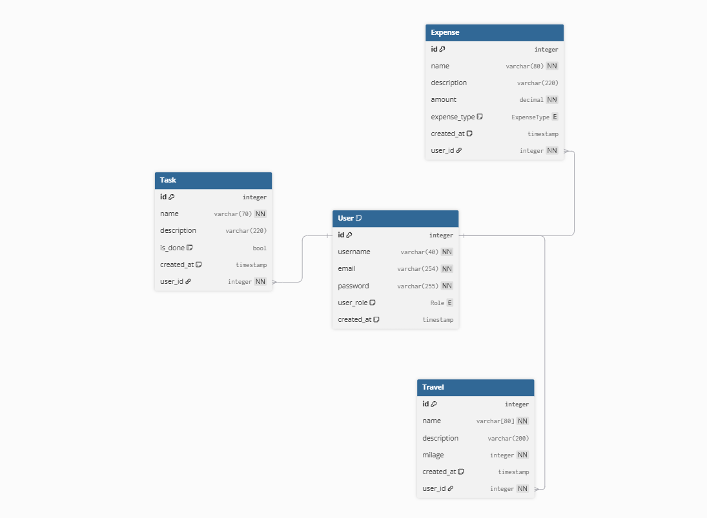

# Design Document

By Nipun Jayawantha

Video overview: <URL HERE>

## Scope

The purpose of the database is to act as the foundation of an app that I am building for my daily use. My job requires me to travel 150–200 kilometers daily, so I need a way to keep track of my expenses, tasks, and travels. This will allow me to use my resources, like fuel, allowances, and time, as efficiently as possible. It will also help me track my tasks, mileage, and expenses so I can cut off or limit unnecessary expenses, travel, and tasks.

### In-Scope

The scope of this database includes:

* Tracking **travel** details, such as mileage, descriptions, etc.

* Tracking **expense** details, such as amount, name, priority, etc.

* Tracking main **user** details, such as name, email, etc.

### Out-of-Scope

The following items are out of scope for this database:

* Supporting multiple users.

* GPS tracking.

* Payment systems or bank API integrations.

## Functional Requirements

### User Capabilities

With this database, users will be able to perform full CRUD (Create, Read, Update, Delete) operations across three core modules: Tasks, Travel, and Expenses. Additionally, the system provides integrated analytics to track and improve personal productivity.

### beyond the scope of what a user should be able to do with your database?
Currently, the database requires SQL knowledge for direct interaction, as there is no graphical interface. However, this is a temporary limitation; a dedicated web application is planned for future development to make the database accessible to non-technical users

## Representation

### Entities
#### User
The **User** table includes:
- `id`: column represents a **unique** ID value for the user, and it has the **primary key** constraint. It uses the data type `INT`.
- `username`: column is responsible for storing the name of the user. It has the data type `VARCHAR` with a maximum length of `40` characters. It is required.
- `email`: column is responsible for storing the email of the user. It has the data type `VARCHAR` with a maximum length of `254` characters. It is required.
- `password`: column is responsible for storing the encrypted password of the user. It has the data type `VARCHAR` with a maximum length of `255` characters. It is required.
- `user_role`: column is responsible for storing the user role. It has the data type `ENUM` (`user`, `admin`).
- `created_at`: column is responsible for storing the timestamp when a user is created. It has the data type `TIMESTAMP` and a default value of the current timestamp.

#### Task
The **Task** table includes:
- `id`: column represents a **unique** ID value for the task, and it has the **primary key** constraint. It uses the data type `INT`.
- `name`: column is responsible for storing the name of the task. It has the data type `VARCHAR` with a maximum length of `70` characters. It is required.
- `description`: column is responsible for storing the description of the task. It has the data type `VARCHAR` with a maximum length of `220` characters. It is not required.
- `is_done`: column is responsible for storing whether the task is done or not. It has the data type `BOOL` and a default value of `false`.
- `created_at`: column is responsible for storing the timestamp when a task is created. It has the data type `TIMESTAMP` and a default value of the current timestamp.
- `user_id`: column is responsible for storing the ID of the user by whom the task was created. It has a **foreign key** constraint and references the `id` column in the `User` table.

#### Expense
The **Expense** table includes:
- `id`: column represents a **unique** ID value for the expense, and it has the **primary key** constraint. It uses the data type `INT`.
- `name`: column is responsible for storing the name of the expense. It has the data type `VARCHAR` with a maximum length of `80` characters. It is required.
- `description`: column is responsible for storing the description of the expense. It has the data type `VARCHAR` with a maximum length of `220` characters. It is not required.
- `amount`: column is responsible for storing the value of the expense. It has the data type `DECIMAL` and it is required.
- `expense_type`: column is responsible for storing the type of the expense (`need` or `want`). It has the data type `ENUM` and it is required.
- `created_at`: column is responsible for storing the timestamp when an expense is created. It has the data type `TIMESTAMP` and a default value of the current timestamp.
- `user_id`: column is responsible for storing the ID of the user by whom the expense was made. It has a **foreign key** constraint and references the `id` column in the `User` table.

### Travel
The **Travel** table includes:
- `id`: column represents a **unique** ID value for the travel entry, and it has the **primary key** constraint. It uses the data type `INT`.
- `name`: column is responsible for storing the name of the travel. It has the data type `VARCHAR` with a maximum length of `70` characters. It is required.
- `description`: column is responsible for storing the description of the travel. It has the data type `VARCHAR` with a maximum length of `200` characters. It is not required.
- `mileage`: column is responsible for storing the mileage count of the travel. It has the data type `INT` and it is required.
- `created_at`: column is responsible for storing the timestamp when a travel entry is created. It has the data type `TIMESTAMP` and a default value of the current timestamp.
- `user_id`: column is responsible for storing the ID of the user by whom the travel was done. It has a **foreign key** constraint and references the `id` column in the `User` table.

### Relationships

This database mainly focuses on a single user, so the relationships are as follows:

- The `User` table has a **one-to-many** relationship with the `Task` table.
- The `User` table has a **one-to-many** relationship with the `Expense` table.
- The `User` table has a **one-to-many** relationship with the `Travel` table.

The ER diagram below illustrates the relationships between the tables in the database.

## Optimizations

This application is intended for a single user, so the default optimization is sufficient. Indexing and other optimization techniques may be added when the application goes live and supports multiple users simultaneously.

## Limitations

- This design does not represent real-world applications. For example, Travel can have expenses, and Tasks can have expenses, but this design does not represent those relationships.
- This design does not support multiple users.
